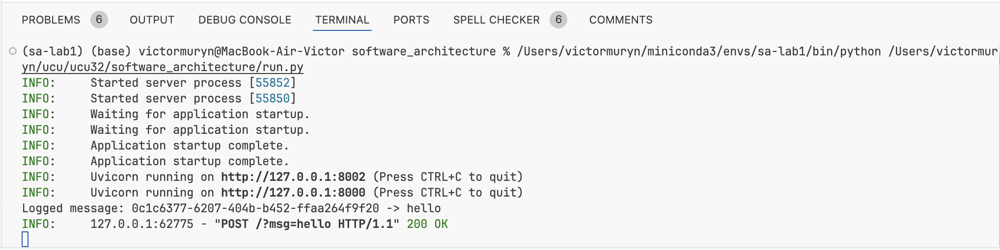
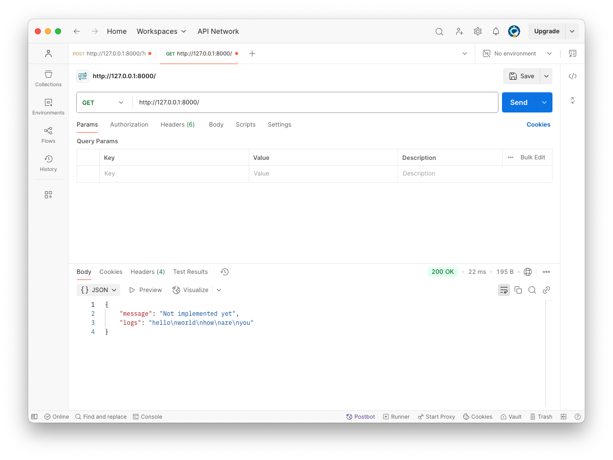
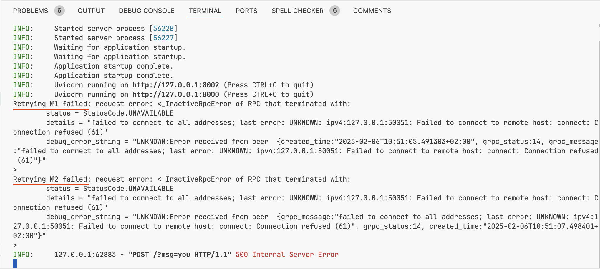
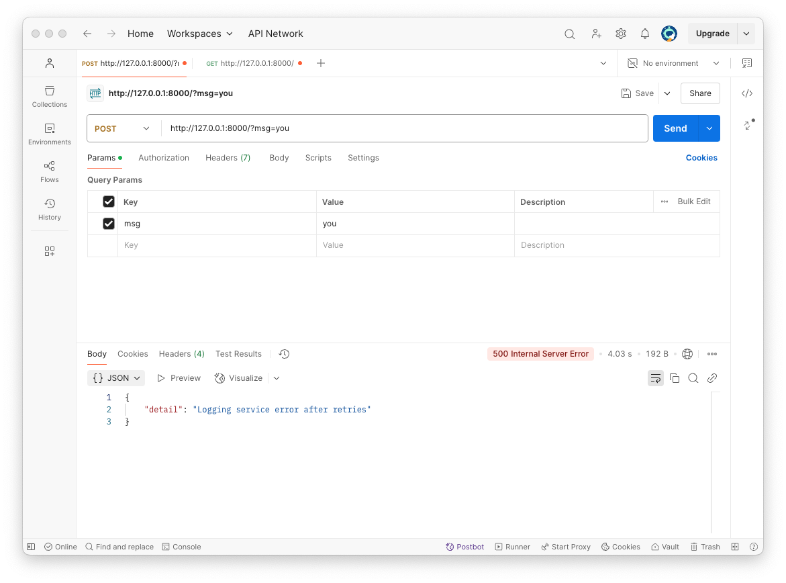

# Software architecture: task 1 - basic microservice architecture
## Basic functionality
In this microservice architecture there are 2 end-point services (*logging_service* and *messages_service* working on ports 50051 and 8002 consistently) and 1 that connects both and gives outer API using REST protocol (facade_service on port 8000).

`run.py` only start all 3 micro-services at the same time at different processes.
Start program using:
```shell
python3 run.py
```

Facade service has 2 end-points on API:
- POST (ex. http://127.0.0.1:8000/?msg=hello). This method allows to add a new message. It will send gRPC call to logging_service that will save log. This call will return status and uuid of message. If there was an error during sending to logging_service, there will be automatic procedure retry.
Postman output

Terminal output


- GET (ex. http://127.0.0.1:8000/). This method will send 2 calls:
    - GET to messages_service that must return static message "Not implemented yet"
    - to logging_service with gRPC to get all logs. If there is no response from logging_service, the retry procedure will be called


## Retry example:
To try *retry* feature lets start application without logging service and try to send POST/GET.

Here we can see that facade service made 2 retries (the number of retries is configured in .env file), logged in terminal errors and give a human-readable response in Postman.




## Additional tasks
- Retry feature
- gRPC protocol