## Microservices with Hazelcast Distributed Map

I changed run.py logic, so it starts 3 logging-services on different ports (see .env). Each logging-service starts its own Hazelcast instance. Instead of dictionary, I used Hazelcast Distributed Map to store logs. Now facade-service chooses at random one of the logging-services to send logs to. If the chosen logging-service is down, facade-service chooses another one.

### 1. Write 10 messages
Using Postman I sent 10 POST requests to http://127.0.0.1:8000/?msg=msg{i} to facade-service. At the screen below you can see that each request was sent to random logging-service ("Logged message {port}: msg{i}").
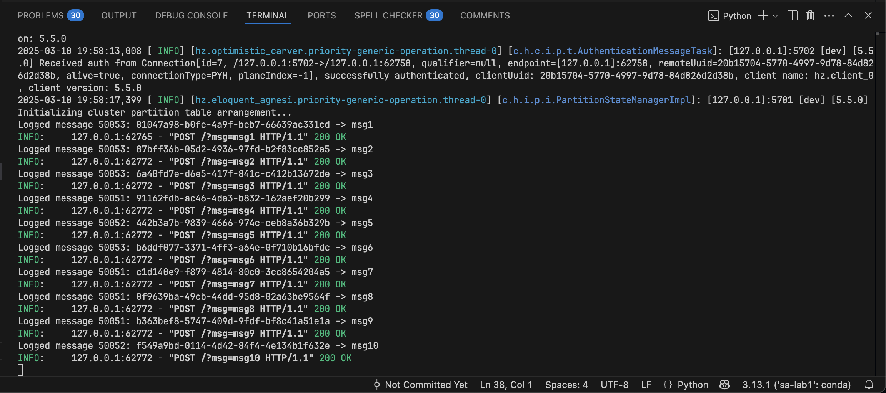

### 2. Check logs
To check logs I sent GET request to http://127.0.0.1:8000. As you can see, all 10 messages were successfully logged.
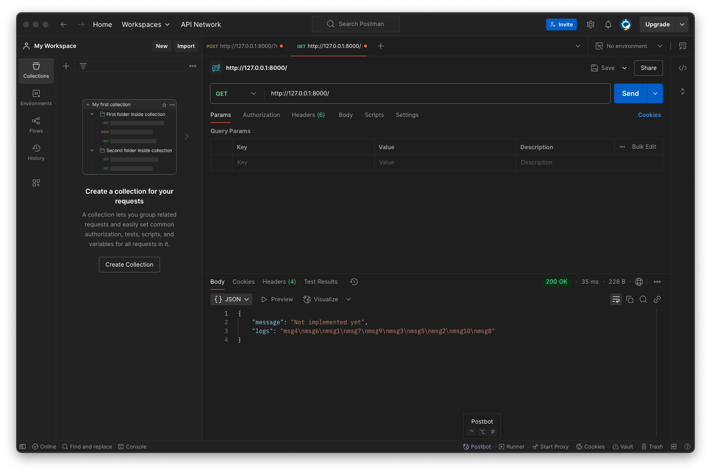

### 3. Stop one of the logging-services
I stopped logging-service on port 50051 using `kill -9`. Also, I killed corresponding Hazelcast instance on port 5701.
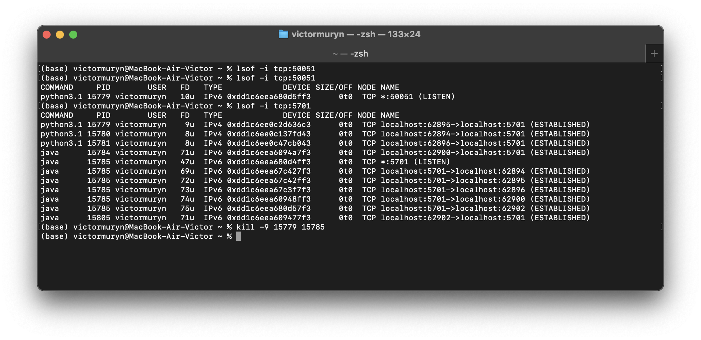

After that tried to receive logs again. As you can see, facade-service chose another logging-service to send logs to. All 10 messages were successfully logged.
  
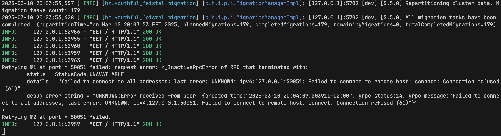
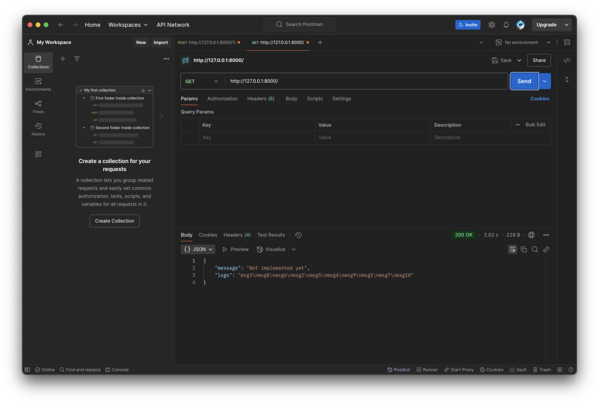

### 4. Stop another logging-service
After that I recreated scene and stopped 2 logging-services on port 50051 and 50052 consistently. Also, I killed
corresponding Hazelcast instances on ports 5701 and 5702. 
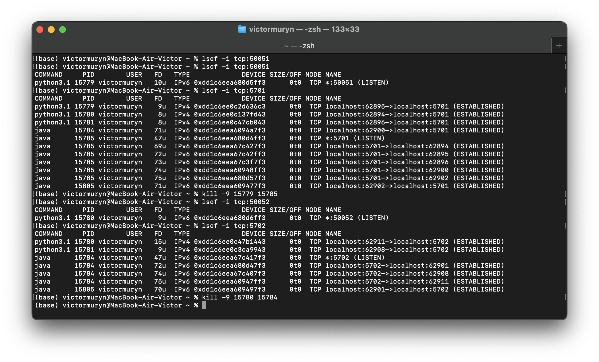

After that tried to receive logs again. As you can see, facade-service chose the last logging-service to send logs to. All 10 messages were successfully logged.

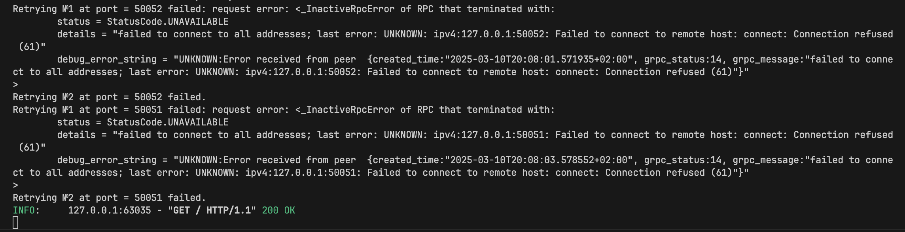
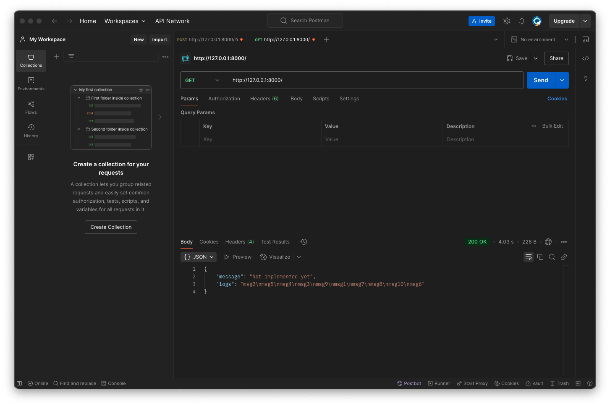

### 5. Stop 2 logging-services at the same time
I stopped 2 logging-services on port 50051 and 50052 at the same time. Also, I killed
corresponding Hazelcast instances on ports 5701 and 5702.
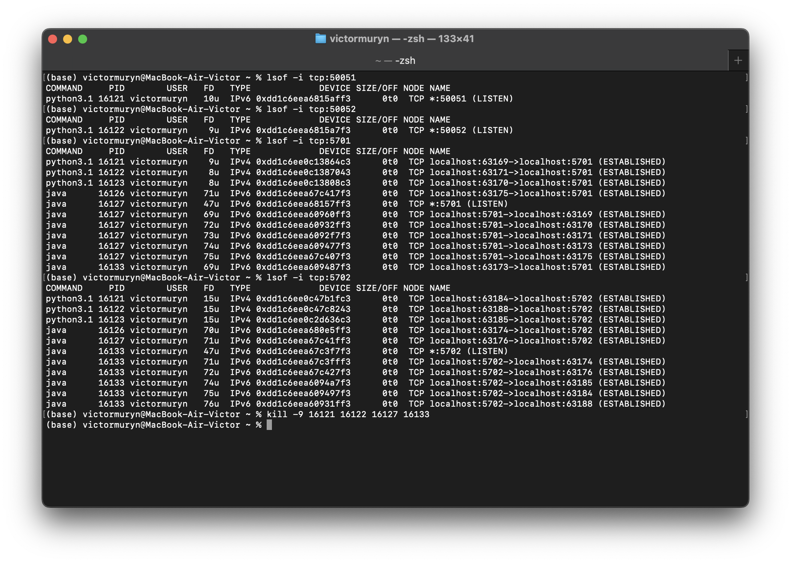

This time Hazelcast didn't managed to save all 10 messages. Only 7 messages were saved.

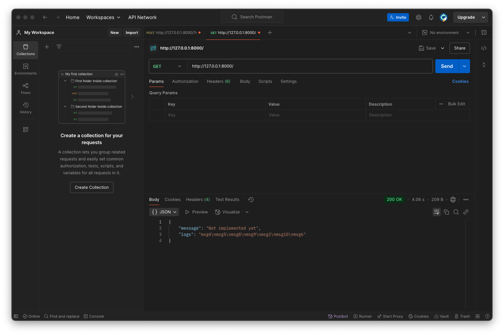

### Additional
Since urls of services might be dynamic, I moved logic of retrieving urls of services to config_server. Now facade-service gets urls of services from config_server. Config_server reads urls from .env file. Before each request, facade-service gets urls from config_server. If facade-service can't get urls from config_server, it shows an exception.

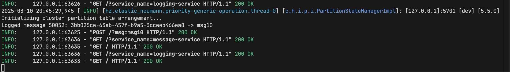

Here we can see that before each request facade-service gets urls from config_server. If it would overload the system, we could add caching to config_server.