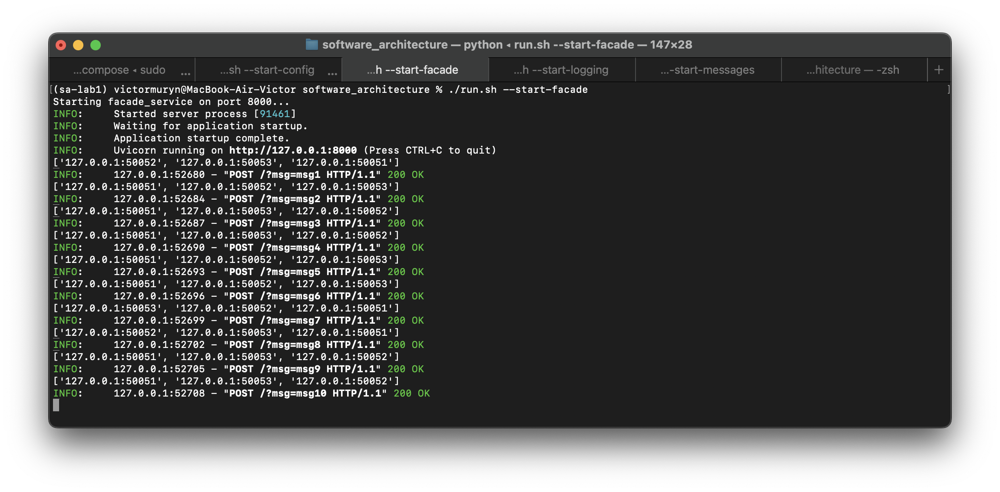
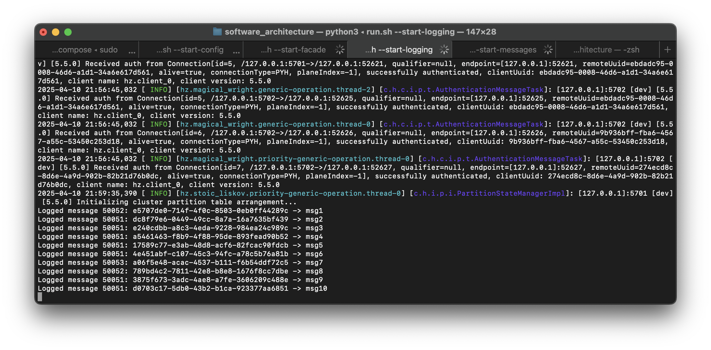
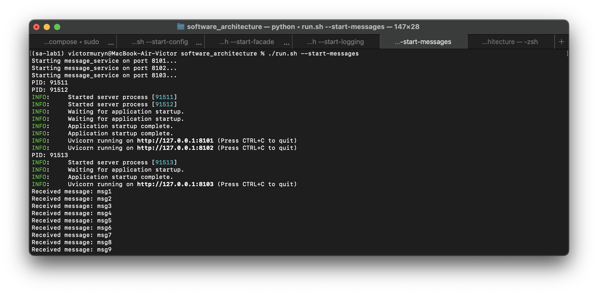
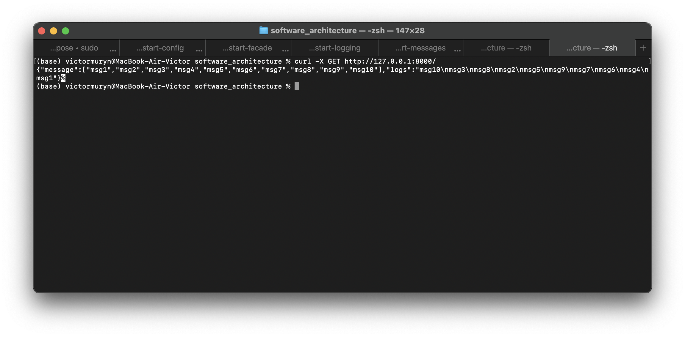
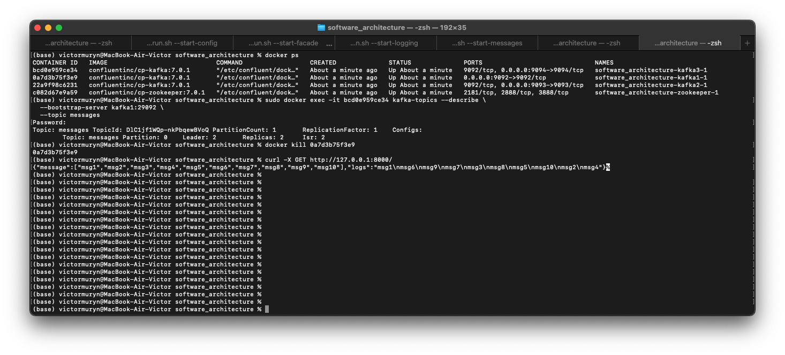
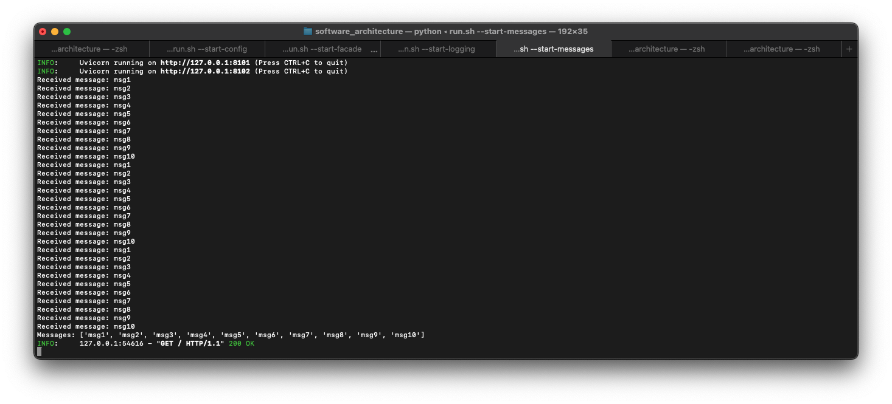

# Microservices_with_MessageQueue (Kafka)

## Usage
```
docker-compose up
```

Then run run.sh to start the services. Here are the available commands:
| Flag              | Description                                                                 |
|-------------------|-----------------------------------------------------------------------------|
| `--start-logging` | Starts the logging service(s) using gRPC and Hazelcast on specified ports.  |
| `--start-messages`| Starts the message service(s) using Uvicorn on specified ports.             |
| `--start-facade`  | Starts the facade service using Uvicorn on the configured port.             |
| `--start-config`  | Starts the configuration server using Uvicorn on the configured port.       |
| `--stop-logging`  | Stops the logging service(s) and any associated Hazelcast instances.        |
| `--stop-messages` | Stops the message service(s).                                               |
| `--stop-facade`   | Stops the facade service.                                                   |
| `--stop-config`   | Stops the configuration server.                                             |
| `--start-all`     | Starts all services: logging, messages, facade, and configuration.          |
| `--stop-all`      | Stops all services: logging, messages, facade, and configuration.           |


You can run 
```
./run.sh --start-all
```
to start all services at once or run 
```
./run.sh --start-logging
./run.sh --start-messages
./run.sh --start-facade
./run.sh --start-config
```
in different terminals to start each service separately.

Also use 
```
./run.sh --stop-all
```
to stop all services at once or run 
```
./run.sh --stop-messages
```
to stop the message service.

## Services

| Service            | Ports             | Method | Endpoint           | Description                                         |
|--------------------|------------------|--------|--------------------|-----------------------------------------------------|
| Facade Service     | 8000             | GET    | `/`                | Root endpoint for facade service                    |
|                    |                  | POST   | `/?msg=...`        | Sends a message through the facade                  |
| Config Server      | 8001             | GET    | `/?service_name...`| Retrieves configuration for a specific service      |
| Message Service    | 8101, 8102, 8103 | GET    | `/`                | Message service root endpoint                       |
| Logging Service    | 50051, 50052, 50053 | -    | -                  | gRPC-based logging service (no HTTP endpoint)       |
| Hazelcast Nodes    | 5701, 5702, 5703 | -      | -                  | Distributed in-memory data grid for logging service |


## Task 1
Create a logging-services and a messages-services. Then send 10 messages. Show the logs of the logging service and the messages service. Call HTTP GET and show results.

To send 10 messages I used the following command:
```sh
for i in {1..10}; 
    do curl -X POST "http://127.0.0.1:8000/?msg=msg$i"; 
done
```
The logs are following.
Facade service logs:


Logging service logs:


Message service logs:


Then I called the HTTP GET method:
```sh
curl -X GET http://127.0.0.1:8000/   
```

GET request logs:


## Task 2
Turn off messages service and send 10 messages. Then turn off Leader message queue. Start messages service and show the logs. Call HTTP GET and show results.

Firstly, I started config-service, logging-service and facade-service. Then sent 10 messages using the same command as in Task 1.

To turn off the message service I used the following command:
```sh
docker ps
docker exec -it <first-kafka> kafka-topics --describe --bootstrap-server kafka1:29092 --topic messages
```
View Leader id and stop using
```sh
docker stop <leader-id>
```



After that I started the message service and checked the logs:


And GET request logs:


## Additional tasks
- Use Kafka