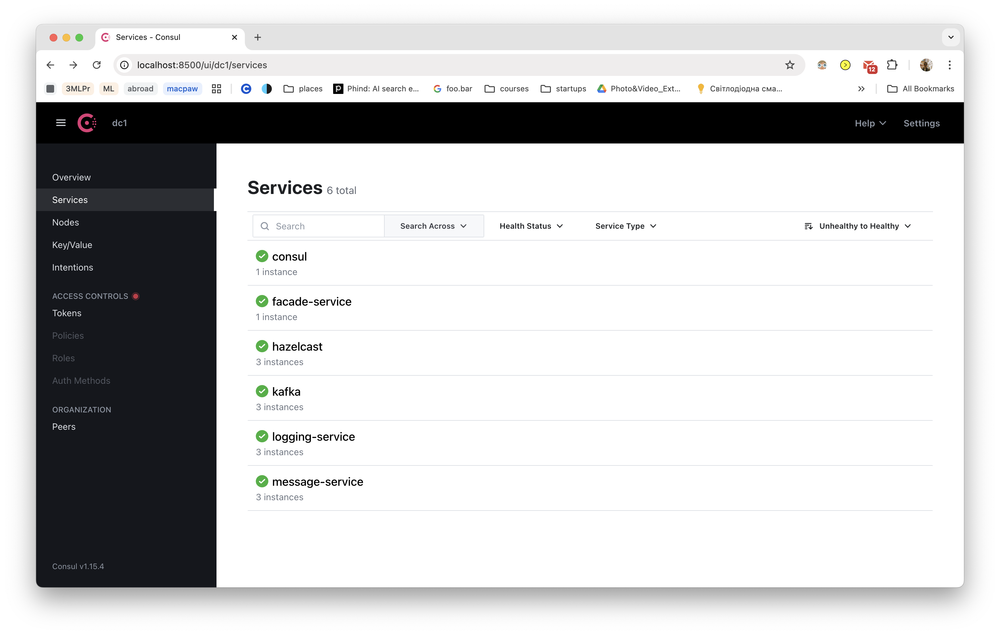
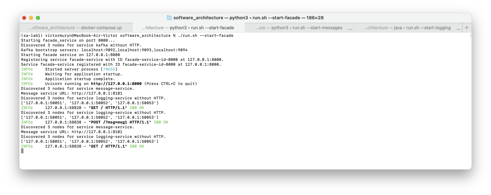
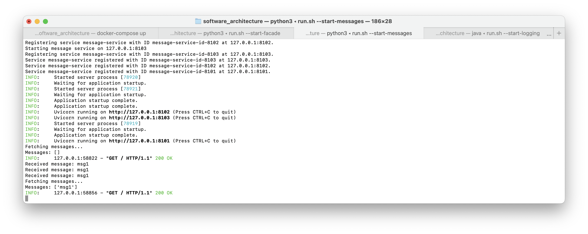
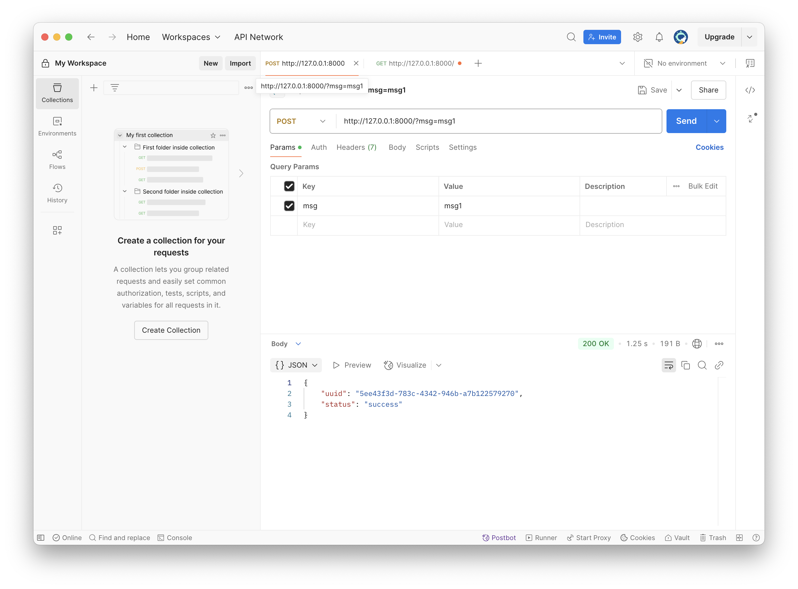
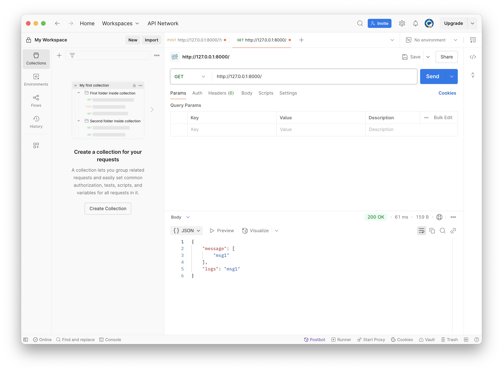

# Microservices_with_MessageQueue (Kafka)

## Usage
```
docker-compose up
```

Then run run.sh to start the services. Here are the available commands:
| Flag              | Description                                                                 |
|-------------------|-----------------------------------------------------------------------------|
| `--start-logging` | Starts the logging service(s) using gRPC and Hazelcast on specified ports.  |
| `--start-messages`| Starts the message service(s) using Uvicorn on specified ports.             |
| `--start-facade`  | Starts the facade service using Uvicorn on the configured port.             |
| `--stop-logging`  | Stops the logging service(s) and any associated Hazelcast instances.        |
| `--stop-messages` | Stops the message service(s).                                               |
| `--stop-facade`   | Stops the facade service.                                                   |
| `--start-all`     | Starts all services: logging, messages, facade, and configuration.          |
| `--stop-all`      | Stops all services: logging, messages, facade, and configuration.           |


You can run 
```
./run.sh --start-all
```
to start all services at once or run 
```
./run.sh --start-logging
./run.sh --start-messages
./run.sh --start-facade
```
in different terminals to start each service separately.

Also use 
```
./run.sh --stop-all
```
to stop all services at once or run 
```
./run.sh --stop-messages
```
to stop the message service.

## Services

Find hosts and ports in Consul.

## Task

As you may see in services, all services register themselves to Consul. You can use Consul UI to see the services and their health status. Kafka registers itself in docker-compose.yml file. Hazelcast registers in run.sh. You can see the health status of Kafka in Consul UI as well.



Now, when microservices try to communicate with each other, they use Consul to discover the services and their health status. For example, if the facade service wants to send a message, it use Consul to find the address of the message service and send the message to it. You can see this on 2 screenshots below:



Also, the system still works fine



Also, if something goes wrong, service deregisters itself from Consul. For example, if the message service is stopped, it will deregister itself from Consul and it will not be available for other services. You can see this in Consul UI as well.